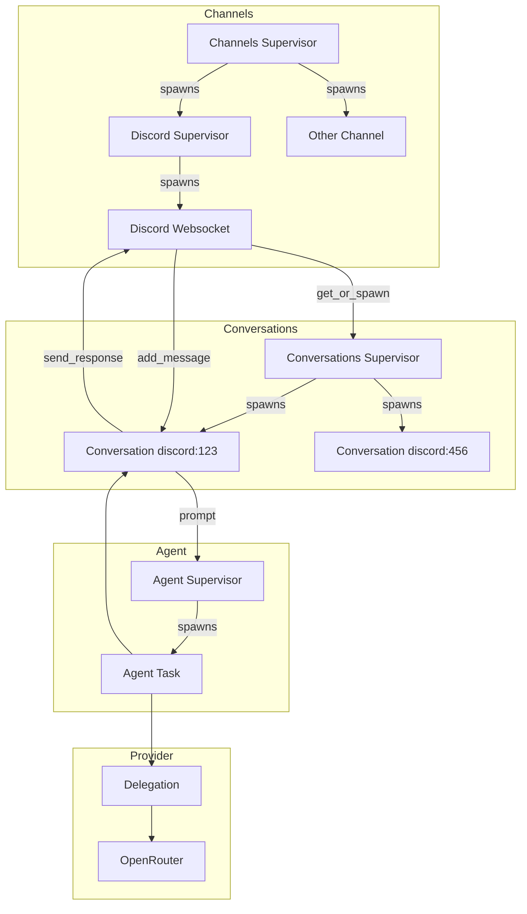

# Lobber
## Lobot O. Mite

It's a claw that has been lobotomised. All the useful framework that these \*claw-likes do but without
the infinite security nightmare.

it's a scalable, resilient, _SECURE_ AI agent that communicates over discord (or others if you want) and does things for you,
whilst not being weird about it.

It is very cute, says things like
> Lobber not like BEEEEEEP.
> Lobber say hello! Lobber have add tool. Need more tool? Lobber can get.
> Lobber try add text tool. Text tool not exist. Lobber not know what to do.

we love lobber

## Key features
- Ability to draft its own tools for later use (manual review required)
- Hot reloading of custom tools and system prompt via `!!reload`
- Persistent memories and identity management
- Lazy tool loading, so JSON schemas don't eat your context om nom nom
  - the agent uses a meta-tool `add-tool` which provides the tool schema to it on the next turn
- Retained chain of thought so your lobber can remember what it was thinking when it did something
- Lobber's own little cave where it stores shiny rocks (markdown files) for later use
- NO SILLY BASH EXECUTION WE'RE ALL ELIXIR ALL THE WAY DOWN
- Dynamic context compaction via `!!compact` to keep your conversations going

## Lobber's design

