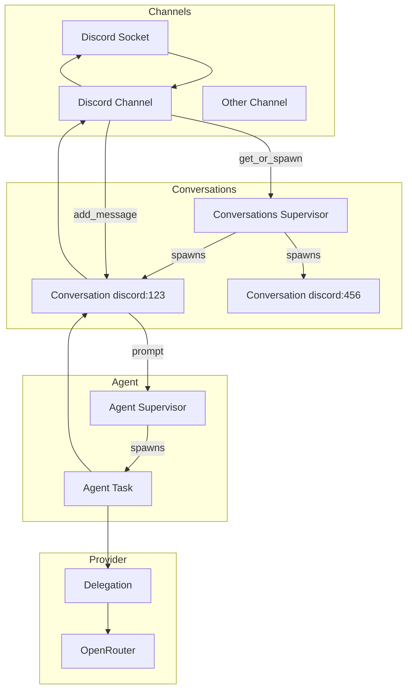

# Lobber
## Lobot O. Mite

It's a claw that has been lobotomised. All the useful framework that these \*claw-likes do but without
the infinite security nightmare.

It's a little elixir process that communicates over discord (or others if you want) and does things for you,
whilst not being weird about it.

It is very cute, says things like
> Lobber not like BEEEEEEP.
> Lobber say hello! Lobber have add tool. Need more tool? Lobber can get.
> Lobber try add text tool. Text tool not exist. Lobber not know what to do.

we love lobber

## Lobber's design

